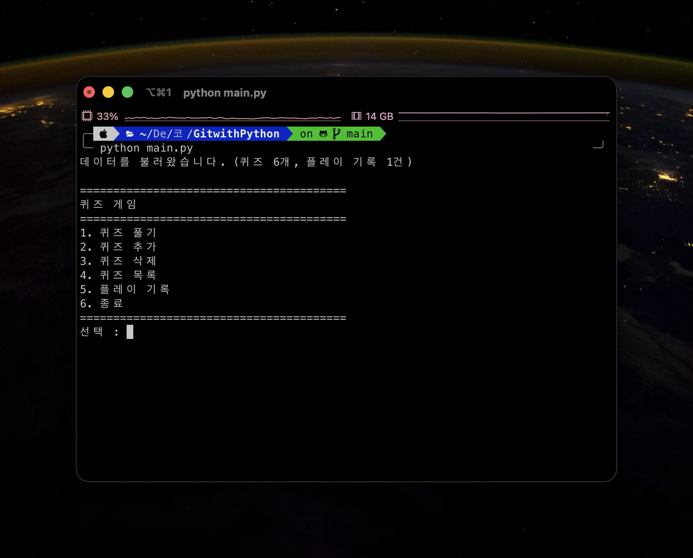
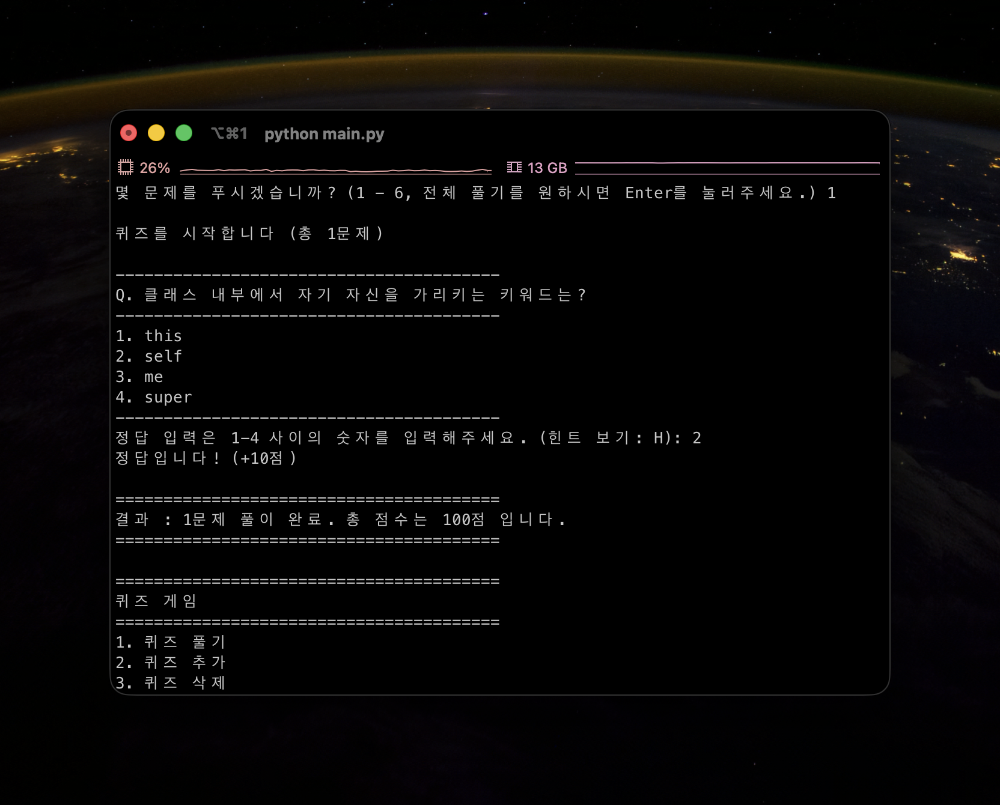
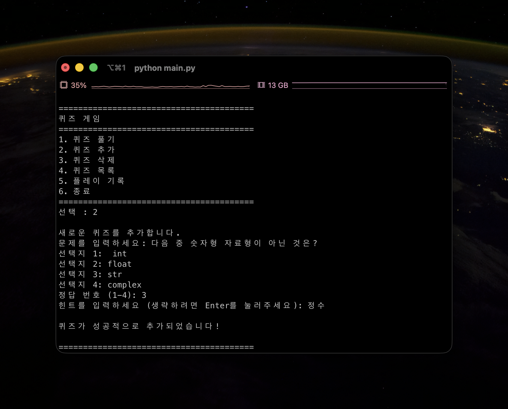
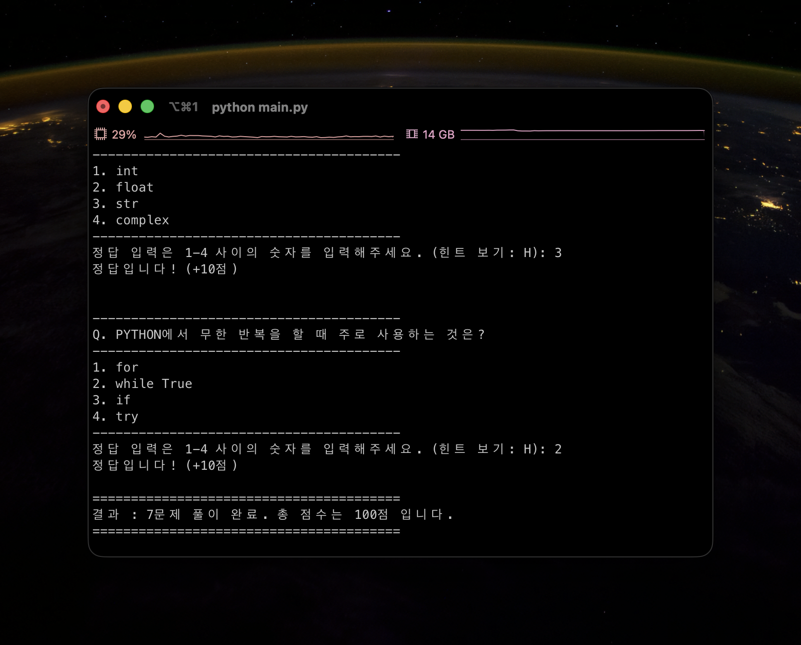
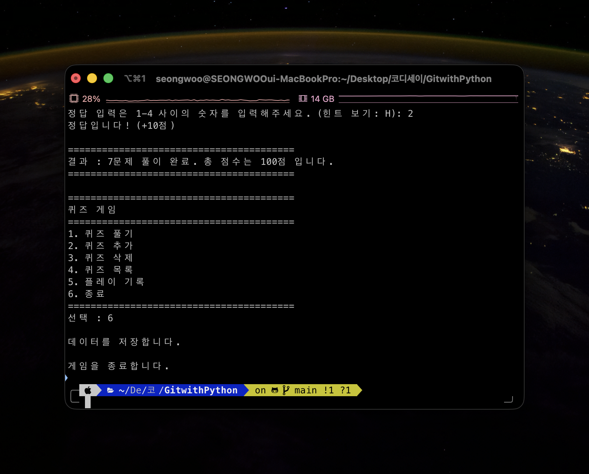
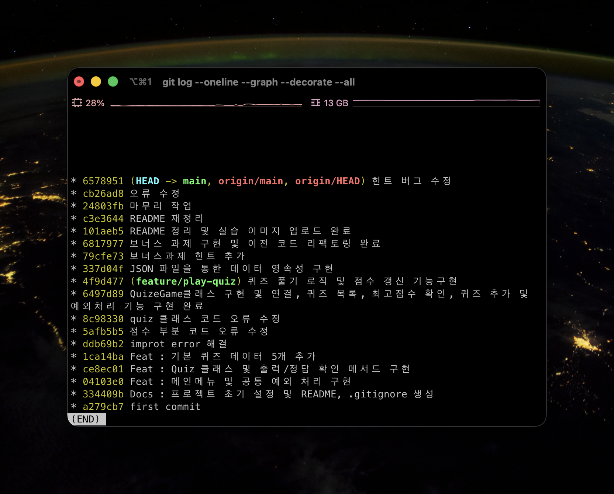

# GitwithPython

Python과 Git 학습을 위해 만든 터미널 기반 퀴즈 게임 프로젝트입니다.

이 README는 단순 소개 문서가 아니라, 평가 기준 1~20을 바로 확인할 수 있도록 다음 내용을 한 번에 정리한 제출용 문서입니다.

- 프로젝트 개요와 실행 방법
- 실제 소스 코드 위치와 클래스 책임 분리
- 입력 검증, 게임 진행, 데이터 저장 흐름 설명
- `state.json` 데이터 구조와 영속성 설명
- GitHub 저장소 링크, 커밋 이력, 브랜치 작업 흔적
- 심층 인터뷰형 질문에 대한 답변

## 1. 프로젝트 개요

### 프로젝트 목적

- Python 기본 문법, 클래스, 파일 입출력, 예외 처리를 직접 활용해 보는 것
- Git으로 기능 단위 커밋과 버전 관리를 연습하는 것
- 터미널 환경에서 동작하는 작은 프로그램을 끝까지 완성하는 것

### 핵심 기능

- 메뉴 출력 및 기능 선택
- 퀴즈 풀기
- 퀴즈 추가
- 퀴즈 삭제
- 퀴즈 목록 조회
- 최고 점수 및 플레이 기록 확인
- `state.json`을 이용한 데이터 영속성
- `Ctrl+C`, `EOF` 상황에서 안전 종료

### 보너스 기능

- 힌트 보기
- 퀴즈 삭제 기능

## 2. 실행 환경

| 항목 | 버전 |
| --- | --- |
| OS | macOS 26.3.1 (a) (25D771280a) |
| Shell | zsh 5.9 (arm64-apple-darwin25.0) |
| Terminal | iTerm2 (Build 3.6.9) |
| Python | 3.13.2 |
| Git | 2.50.1 (Apple Git-155) |

## 3. 저장소 정보 및 실행 방법

### GitHub 저장소

- 저장소 주소: [https://github.com/big-brother-M/GitwithPython](https://github.com/big-brother-M/GitwithPython)
- 주요 파일 바로가기: [main.py](./main.py), [quiz.py](./quiz.py), [quiz_game.py](./quiz_game.py), [state.json](./state.json)

### 원격 저장소 연결 확인

```bash
$ git remote -v
origin  https://github.com/big-brother-M/GitwithPython.git (fetch)
origin  https://github.com/big-brother-M/GitwithPython.git (push)
```

### clone / pull 실습 흔적

현재 환경에서 로컬 재현용으로 다시 클론하고 `pull`까지 수행한 기록입니다.

```bash
$ git clone /Users/seongwoo/Desktop/코디세이/GitwithPython /tmp/GitwithPython-clone
Cloning into '/tmp/GitwithPython-clone'...
done.

$ cd /tmp/GitwithPython-clone
$ git pull
Already up to date.
```

평가 제출 시에는 위와 같은 형태로 `clone`과 `pull` 명령 수행 흔적을 함께 제시하면 됩니다.

### 실행 방법

```bash
python3 main.py
```

## 4. 프로젝트 구조

```text
GitwithPython/
├── main.py                  # 프로그램 진입점, 메뉴 출력, 공통 입력/종료 처리
├── quiz.py                  # Quiz 클래스, 기본 퀴즈 5개 생성 함수
├── quiz_game.py             # QuizGame 클래스, 게임 진행/기록/저장/불러오기 담당
├── state.json               # 퀴즈, 플레이 기록, 최고 점수 저장 파일
├── README.md                # 프로젝트 설명서
└── docs/
    └── screenshots/
        ├── menu.png
        ├── play.png
        ├── add_quiz.png
        ├── score.png
        └── save.png
```

## 5. 기능 구현 근거

| 기능 | 구현 위치 | 동작 설명 | 관련 평가 기준 |
| --- | --- | --- | --- |
| 메뉴 표시 | `main.py`의 `print_menu()` | 프로그램 시작 후 1~6번 메뉴를 출력 | 1 |
| 메뉴 입력 검증 | `main.py`의 `get_val_input()` | 빈 입력, 문자 입력, 범위 밖 입력을 반복 검증 | 1, 2 |
| 퀴즈 풀기 | `quiz_game.py`의 `play_quiz()` | 문제 수 선택, 랜덤 출제, 정답 판정, 점수 계산, 기록 저장 | 1, 2, 3 |
| 퀴즈 추가 | `quiz_game.py`의 `add_quiz()` | 문제/선택지/정답/힌트를 입력받아 퀴즈 목록에 추가 | 1, 2, 3 |
| 퀴즈 삭제 | `quiz_game.py`의 `delete_quiz()` | 번호를 선택해 기존 퀴즈를 삭제 | 보너스 |
| 퀴즈 목록 | `quiz_game.py`의 `show_quiz_list()` | 현재 등록된 퀴즈 개수와 문제 목록을 출력 | 1 |
| 점수/기록 확인 | `quiz_game.py`의 `show_history()` | 최고 점수와 최근 플레이 기록을 출력 | 1, 3 |
| 기본 퀴즈 제공 | `quiz.py`의 `get_default_quizzers()` | 초기 실행 시 사용할 기본 퀴즈 5개를 생성 | 4 |
| 데이터 저장 | `quiz_game.py`의 `save_data()` | 퀴즈 객체를 JSON 직렬화 형태로 변환해 저장 | 3, 10, 14, 15, 17 |
| 데이터 불러오기 | `quiz_game.py`의 `load_data()` | 파일 존재 여부 확인 후 퀴즈/기록/최고점수 복원 | 3, 10, 15, 17, 19 |
| 안전 종료 | `main.py`의 `try/except` | `KeyboardInterrupt`, `EOFError` 발생 시 저장 후 종료 | 11, 15 |

## 6. 기본 퀴즈 데이터 확인

기본 퀴즈는 [quiz.py](./quiz.py)의 `get_default_quizzers()` 함수에서 총 5개가 생성됩니다.

| 번호 | 기본 퀴즈 문제 |
| --- | --- |
| 1 | `PYTHON의 창시자는 누구인가요?` |
| 2 | `다음 중 PYTHON의 기본 자료형이 아닌것은?` |
| 3 | `Git에서 변경사항을 확정짓는 명령어는?` |
| 4 | `PYTHON에서 무한 반복을 할 때 주로 사용하는 것은?` |
| 5 | `클래스 내부에서 자기 자신을 가리키는 키워드는?` |

추가로 현재 [state.json](./state.json)에는 사용자가 실행 중 추가한 퀴즈가 반영되어 총 7개의 퀴즈가 저장되어 있습니다. 즉, 기본 데이터 5개 이상 조건을 충족하고, 실행 후 추가 데이터도 영속적으로 누적됩니다.

## 7. 입력 검증 및 예외 처리

### 메뉴 입력 검증

`main.py`의 `get_val_input()`은 다음 케이스를 처리합니다.

- 빈 입력: `"입력이 확인 되지 않았습니다. 다시 입력해주세요."`
- 숫자가 아닌 입력: `ValueError`를 잡아 `"1-6 사이의 숫자를 입력해주세요."`
- 범위 밖 숫자 입력: `1 <= choice <= 6` 검증 후 재입력 요구

### 퀴즈 진행 입력 검증

`quiz_game.py`의 `play_quiz()`는 다음 케이스를 처리합니다.

- 몇 문제를 풀지 입력할 때 `Enter`: 전체 문제 수로 자동 설정
- 숫자가 아닌 문제 수 입력: `"숫자만 입력해주세요."`
- 문제 수 범위 오류: `"1부터 {max_q} 사이의 숫자를 입력해주세요."`
- 정답 입력이 빈 문자열인 경우: `"빈 입력입니다. 다시 입력해주세요."`
- 정답 입력이 `H` 또는 `h`인 경우: 힌트 출력
- 힌트 중복 요청: `"이미 힌트를 사용하셨습니다."`
- 정답 입력이 숫자가 아니고 힌트도 아닌 경우: `"숫자를 입력해주시거나 'H'를 입력해주세요."`
- 정답 입력이 1~4 범위를 벗어난 경우: `"1-4 사이의 숫자만 입력해주세요."`

즉, 평가 기준 2에서 요구한 최소 입력 오류 케이스인 빈 입력, 문자 입력, 범위 밖 숫자 입력을 모두 코드로 처리하고 있습니다.

### 퀴즈 추가 입력 검증

`quiz_game.py`의 `add_quiz()`는 다음 케이스를 처리합니다.

- 문제 본문이 빈 입력이면 추가 취소
- 선택지 4개는 각각 빈 입력을 허용하지 않음
- 정답 번호는 빈 입력, 문자 입력, 1~4 범위 밖 입력을 모두 차단
- 힌트는 생략 가능하며 `Enter` 시 기본 문구 저장

### 퀴즈 삭제 입력 검증

`quiz_game.py`의 `delete_quiz()`는 다음 케이스를 처리합니다.

- 빈 입력이면 다시 입력 요구
- 숫자가 아니면 `"숫자만 입력해주세요."`
- `0` 입력 시 삭제 취소
- 존재하지 않는 번호 입력 시 `"목록에 존재하는 번호를 입력해주세요."`

### 파일 입출력 예외 처리

`quiz_game.py`는 파일 입출력 중 발생 가능한 예외를 `try/except`로 처리합니다.

- 저장 실패 시 `OSError`를 잡고 오류 메시지 출력
- 불러오기 시 `json.JSONDecodeError`, `KeyError`, `TypeError` 발생 시 기본 퀴즈로 초기화

## 8. 클래스 설계와 책임 분리

| 구성 요소 | 책임 | 분리한 이유 |
| --- | --- | --- |
| `main.py` | 메뉴 출력, 사용자 선택 분기, 안전 종료 | 프로그램 진입점과 UI 흐름을 한 곳에 두기 위해 |
| `Quiz` 클래스 | 퀴즈 1개의 데이터 보관, 문제 출력, 정답 판정 | 문제 단위 데이터를 객체로 묶어 재사용하기 위해 |
| `QuizGame` 클래스 | 퀴즈 목록, 플레이 기록, 점수, 저장/불러오기, 게임 진행 | 전체 게임 상태와 동작을 관리하기 위해 |

### `Quiz`와 `QuizGame`의 책임 차이

- `Quiz`는 한 문제를 표현하는 가장 작은 단위입니다.
- `Quiz`는 `question`, `choices`, `answer`, `hint`를 보관하고 `display_quiz()`, `check_answer()`를 제공합니다.
- `QuizGame`은 여러 개의 `Quiz`를 모아서 전체 게임을 운영합니다.
- `QuizGame`은 퀴즈를 고르고, 기록을 누적하고, 파일에 저장하고, 메뉴 기능과 연결되는 상위 관리자 역할을 합니다.

### 클래스를 사용한 이유

함수만으로도 구현은 가능하지만, 이 프로젝트에서는 클래스를 쓰는 편이 더 적절합니다.

- 퀴즈 1개에 대한 데이터와 동작을 `Quiz` 객체 하나로 묶을 수 있습니다.
- 게임 전체 상태인 `quizzes`, `history`, `best_score`, `file_path`를 `QuizGame` 객체 안에 모아 관리할 수 있습니다.
- 함수만 사용할 경우 여러 함수에 리스트와 상태값을 계속 전달해야 해서 매개변수가 많아지고 결합도가 올라갑니다.
- 클래스를 쓰면 "개별 문제"와 "게임 전체"의 책임 경계가 분명해집니다.

## 9. 데이터 저장 구조와 처리 흐름

### `state.json` 데이터 구조

현재 프로젝트는 아래 구조로 데이터를 저장합니다.

```json
{
  "quizzes": [
    {
      "question": "PYTHON의 창시자는 누구인가요?",
      "choices": ["빌게이츠", "스티브 잡스", "귀도 반 로섬", "이재용"],
      "answer": 3,
      "hint": "힌트가 존재하지 않습니다."
    }
  ],
  "history": [
    {
      "date": "2026-04-15 13:41:21",
      "played": 7,
      "score": 100
    }
  ],
  "best_score": 100
}
```

### 왜 이 구조로 설계했는가

- `quizzes`: 문제은행 자체를 저장하는 영역입니다.
- `history`: 매 플레이 결과를 남기는 영역입니다.
- `best_score`: 최고 점수를 바로 조회하기 위한 캐시 역할입니다.

즉, "문제 데이터"와 "게임 결과 데이터"를 분리해서 역할을 명확하게 했고, 최고 점수는 기록 전체를 매번 다시 계산하지 않아도 되도록 별도 값으로 둔 구조입니다.

### 불러오기 흐름

프로그램 시작 시 데이터는 아래 순서로 읽힙니다.

1. `main.py`에서 `game = QuizGame()` 실행
2. `QuizGame.__init__()`에서 `load_data()` 호출
3. `state.json` 파일이 없으면 기본 퀴즈 5개를 로드
4. 파일이 있으면 `json.load()`로 읽기
5. `history`, `best_score`를 복원
6. `quizzes` 배열을 순회하면서 각 항목을 다시 `Quiz` 객체로 변환
7. JSON 파싱 실패나 키 누락이 있으면 기본 퀴즈로 초기화

### 저장 흐름

프로그램 종료 시 데이터는 아래 순서로 저장됩니다.

1. `QuizGame.save_data()` 호출
2. `self.quizzes` 안의 `Quiz` 객체를 JSON에 저장 가능한 딕셔너리로 변환
3. `quizzes`, `history`, `best_score`를 하나의 딕셔너리로 구성
4. `json.dump(..., ensure_ascii=False, indent=4)`로 `state.json`에 저장

### JSON 파일을 사용하는 이유

- 사람이 직접 열어 보고 확인하기 쉽습니다.
- Python의 `json.load()`, `json.dump()`로 다루기 쉽습니다.
- 키-값 구조라 퀴즈/기록 같은 데이터 표현에 적합합니다.
- 작은 개인 프로젝트에서는 데이터베이스보다 구현 부담이 적습니다.

### 파일 입출력에서 `try/except`가 필요한 이유

- 파일이 없을 수 있습니다.
- 파일 권한 문제로 저장이 실패할 수 있습니다.
- JSON 문법이 깨져 파싱이 실패할 수 있습니다.
- 일부 키가 누락된 손상 데이터가 들어올 수 있습니다.

즉, 파일 입출력은 외부 환경에 의존하므로 항상 실패 가능성을 고려해야 하며, `try/except`가 없으면 프로그램이 그대로 비정상 종료될 수 있습니다.

## 10. 안전 종료 처리

`main.py`는 전체 메뉴 반복문을 `try` 블록으로 감싸고, 아래 예외를 처리합니다.

- `KeyboardInterrupt`: 사용자가 `Ctrl+C`를 눌렀을 때
- `EOFError`: 입력 스트림 종료(`Ctrl+D` 등)가 발생했을 때

처리 순서는 다음과 같습니다.

1. 강제 종료 감지
2. `"데이터를 저장 후 종료합니다."` 메시지 출력
3. `game.save_data()` 호출
4. `"데이터 저장이 완료되었습니다."` 메시지 출력
5. `sys.exit(0)`으로 정상 종료

즉, 안전 종료의 핵심은 "예외를 잡고, 저장하고, 종료한다"는 순서를 보장하는 것입니다.

## 11. Git 이력과 버전 관리 근거

### 총 커밋 수

현재 `main` 브랜치 기준 총 커밋 수는 14개입니다.

```bash
$ git rev-list --count HEAD
14
```

### 커밋 히스토리

```bash
$ git log --reverse --pretty=format:'%h %s'
a279cb7 first commit
334409b Docs : 프로젝트 초기 설정 및 README, .gitignore 생성
04103e0 Feat : 메인메뉴 및 공통 예외 처리 구현
ce8ec01 Feat : Quiz 클래스 및 출력/정답 확인 메서드 구현
1ca14ba Feat : 기본 퀴즈 데이터 5개 추가
ddb69b2 improt error 해결
5afb5b5 점수 부분 코드 오류 수정
8c98330 quiz 클래스 코드 오류 수정
6497d89 QuizeGame클래스 구현 및 연결, 퀴즈 목록, 최고점수 확인, 퀴즈 추가 및 예외처리 기능 구현 완료
4f9d477 퀴즈 풀기 로직 및 점수 갱신 기능구현
337d04f JSON 파일을 통한 데이터 영속성 구현
79cfe73 보너스과제 힌트 추가
6817977 보너스 과제 구현 및 이전 코드 리팩토링 완료
101aeb5 README 정리 및 실습 이미지 업로드 완료
```

### 커밋을 어떤 단위로 나누었는가

커밋 로그를 보면 다음처럼 기능 단위로 나누어 작업했습니다.

- 초기 설정
- 메뉴 및 공통 예외 처리
- `Quiz` 클래스 구현
- 기본 퀴즈 데이터 추가
- 오류 수정
- `QuizGame` 기능 연결
- 퀴즈 풀기 기능 구현
- JSON 저장 기능 구현
- 힌트/보너스 기능 추가
- 리팩토링
- README 및 이미지 정리

즉, 큰 기능 하나를 한 번에 넣지 않고 "메뉴", "퀴즈 데이터", "게임 로직", "저장 기능", "문서화"처럼 의미 있는 변경 단위로 커밋했습니다.

### 커밋 메시지 규칙

실제 저장소에서는 아래와 같은 패턴이 주로 사용되었습니다.

- `Feat : ...`
- `Docs : ...`
- `... 오류 수정`
- `... 구현 완료`

완전히 엄격하게 통일되지는 않았지만, 대체로 "무슨 종류의 작업인지"와 "무엇을 바꿨는지"가 드러나도록 작성했습니다. 더 깔끔하게 운영하려면 앞으로는 `type: subject` 형식으로 통일하는 것이 좋습니다.

예시:

- `feat: add default quiz dataset`
- `fix: correct score calculation`
- `docs: expand README with git evidence`

### 브랜치 생성 및 반영 흔적

현재 그래프 출력은 아래와 같습니다.

```bash
$ git log --oneline --graph --decorate --all
* 101aeb5 (HEAD -> main, origin/main, origin/HEAD) README 정리 및 실습 이미지 업로드 완료
* 6817977 보너스 과제 구현 및 이전 코드 리팩토링 완료
* 79cfe73 보너스과제 힌트 추가
* 337d04f JSON 파일을 통한 데이터 영속성 구현
* 4f9d477 (feature/play-quiz) 퀴즈 풀기 로직 및 점수 갱신 기능구현
* 6497d89 QuizeGame클래스 구현 및 연결, 퀴즈 목록, 최고점수 확인, 퀴즈 추가 및 예외처리 기능 구현 완료
* 8c98330 quiz 클래스 코드 오류 수정
* 5afb5b5 점수 부분 코드 오류 수정
* ddb69b2 improt error 해결
* 1ca14ba Feat : 기본 퀴즈 데이터 5개 추가
* ce8ec01 Feat : Quiz 클래스 및 출력/정답 확인 메서드 구현
* 04103e0 Feat : 메인메뉴 및 공통 예외 처리 구현
* 334409b Docs : 프로젝트 초기 설정 및 README, .gitignore 생성
* a279cb7 first commit
```

설명:

- `feature/play-quiz` 브랜치를 별도로 두고 퀴즈 플레이 기능을 작업한 흔적이 남아 있습니다.
- 기능 브랜치를 분리하는 이유는 `main` 브랜치를 안정적으로 유지하면서 새로운 기능을 독립적으로 개발하기 위해서입니다.
- merge의 의미는 기능 브랜치에서 검증한 내용을 최종 브랜치인 `main`에 통합하는 것입니다.
- 현재 이력은 별도 merge commit이 크게 드러나는 형태라기보다, 브랜치 작업 흔적이 그래프와 브랜치 포인터로 확인되는 형태입니다.
- 앞으로 평가용으로 더 명확한 흔적을 남기려면 `feature/...` 브랜치에서 작업 후 `git merge --no-ff`를 사용해 merge commit까지 남기면 좋습니다.

## 12. 심층 인터뷰형 질문 대비 답변

### 기준 8. `Quiz`와 `QuizGame`의 책임은 어떻게 나누었는가?

`Quiz`는 문제 1개의 데이터와 동작만 담당합니다. 반면 `QuizGame`은 여러 개의 `Quiz`를 모아 게임 전체 흐름, 기록, 점수, 저장/불러오기를 담당합니다. 즉, "문제 단위"와 "게임 단위" 책임을 분리한 구조입니다.

### 기준 9. 입력 처리, 게임 진행, 저장/불러오기 로직은 어떤 기준으로 분리했는가?

입력 처리는 사용자와 직접 맞닿는 부분이라 메뉴 함수와 각 입력 루프 안에서 검증합니다. 게임 진행은 퀴즈 선택, 정답 판정, 점수 계산처럼 플레이 자체에 관련된 로직이므로 `play_quiz()`에 모았습니다. 저장/불러오기는 파일 시스템과 JSON 변환 책임이므로 `save_data()`, `load_data()`로 독립시켰습니다.

### 기준 10. `state.json` 읽기/쓰기 흐름은 어디서 어떤 순서로 발생하는가?

읽기는 프로그램 시작 직후 `QuizGame.__init__()`에서 `load_data()`를 호출하면서 시작됩니다. 쓰기는 사용자가 종료 메뉴를 선택하거나 강제 종료가 발생했을 때 `save_data()`를 호출하면서 실행됩니다. 즉, 시작 시 1회 로드하고, 종료 시 저장하는 구조입니다.

### 기준 11. `Ctrl+C` 또는 `EOF` 상황에서 안전 종료를 위해 어떤 처리를 했는가?

메인 루프 전체를 `try`로 감싸고 `except (KeyboardInterrupt, EOFError)`에서 종료 신호를 받습니다. 예외가 발생하면 바로 `game.save_data()`를 호출해 현재 퀴즈/기록/최고점수를 저장하고 `sys.exit(0)`으로 종료합니다.

### 기준 12. 커밋은 어떤 단위로 나눴고 메시지 규칙은 어떻게 정했는가?

커밋은 기능 단위와 수정 단위로 나눴습니다. 예를 들어 메뉴 구현, 클래스 구현, 기본 데이터 추가, 퀴즈 풀기, JSON 영속성, README 정리처럼 한 번에 한 주제를 다루도록 나눴습니다. 메시지는 `Feat`, `Docs`, `오류 수정` 중심으로 작성했고, 앞으로는 `feat/fix/docs` 규칙으로 더 엄격히 통일하는 것이 좋습니다.

### 기준 13. 클래스를 사용한 이유와 함수만으로 구현할 때 차이는 무엇인가?

클래스를 쓰면 데이터와 동작을 함께 묶을 수 있어 책임이 분명해집니다. 함수만으로 구현하면 `question`, `choices`, `history`, `best_score` 같은 값을 여러 함수에 계속 전달해야 해서 코드가 흩어지고 상태 관리가 어려워집니다. 이 프로젝트는 "문제 객체"와 "게임 객체"가 자연스럽게 나뉘므로 클래스가 더 적합합니다.

### 기준 14. JSON 파일을 사용하는 이유와 JSON 형식의 특징은 무엇인가?

JSON은 사람이 읽기 쉽고, Python에서 바로 딕셔너리/리스트 구조로 다룰 수 있습니다. 텍스트 기반이라 디버깅이 쉽고, 퀴즈 목록과 플레이 기록처럼 구조화된 데이터를 저장하기에 적합합니다. 작은 CLI 프로젝트에서는 데이터베이스보다 구현 비용이 낮다는 장점도 있습니다.

### 기준 15. 파일 입출력에서 `try/except`가 필요한 이유는 무엇인가?

파일이 없거나, 권한 문제가 있거나, 내용이 깨져 있을 수 있기 때문입니다. 이런 경우를 처리하지 않으면 프로그램이 즉시 종료되므로, 예외를 잡아 기본값으로 복구하거나 사용자에게 오류를 알려야 합니다.

### 기준 16. 브랜치를 분리해 작업한 이유와 merge의 의미는 무엇인가?

브랜치를 분리하면 실험적 기능이나 신규 기능을 `main`과 분리한 채 개발할 수 있어 안정성이 높아집니다. merge는 그 브랜치에서 완성한 작업을 최종 코드 흐름에 합치는 과정입니다. 협업에서는 충돌 해결과 변경 이력 추적에도 중요합니다.

### 기준 17. `state.json` 데이터 구조를 현재 형태로 설계한 이유는 무엇인가?

`quizzes`는 문제은행, `history`는 플레이 결과, `best_score`는 빠른 조회용 요약값이므로 역할이 다릅니다. 이 셋을 분리하면 저장 구조가 명확해지고, 특정 기능을 수정할 때 어느 데이터를 건드려야 하는지 판단하기 쉬워집니다.

### 기준 18. 퀴즈가 1000개 이상으로 늘어나면 현재 JSON 방식의 한계는 무엇인가?

JSON 파일은 저장할 때마다 전체 파일을 다시 쓰고, 시작할 때도 전체를 한 번에 읽습니다. 데이터가 커질수록 로딩 시간과 저장 시간이 늘고, 메모리 사용량도 증가합니다. 검색, 필터링, 동시 접근, 부분 업데이트에도 비효율적이므로 규모가 커지면 SQLite 같은 데이터베이스가 더 적합합니다.

### 기준 19. `state.json`이 손상되어 파싱에 실패하면 어떤 대응이 가능한가?

현재 코드는 `json.JSONDecodeError` 등을 잡아 기본 퀴즈로 초기화하는 방식으로 대응합니다. 더 발전시키려면 손상된 파일을 `.bak`로 백업하고, 마지막 정상 저장본을 복구하거나, 저장 전 임시 파일에 먼저 쓴 뒤 교체하는 방식으로 안정성을 높일 수 있습니다.

### 기준 20. 요구사항이 바뀌면 어떤 파일/클래스/메서드를 먼저 수정해야 하는가?

변경 종류에 따라 시작점이 다릅니다.

- 메뉴 항목 추가: `main.py`의 `print_menu()`, `get_val_input()`, `main()`
- 퀴즈 데이터 형식 변경: `quiz.py`의 `Quiz` 클래스와 `quiz_game.py`의 직렬화/역직렬화 로직
- 점수 규칙 변경: `quiz_game.py`의 `play_quiz()`
- 저장 형식 변경: `quiz_game.py`의 `save_data()`, `load_data()`
- 기본 문제 변경: `quiz.py`의 `get_default_quizzers()`

즉, 이 프로젝트는 요구사항이 바뀌어도 수정 지점을 비교적 빠르게 찾을 수 있도록 파일 책임을 나누어 둔 구조입니다.

## 13. 평가 기준별 빠른 대응표

| 평가 기준 | README에서 확인할 위치 |
| --- | --- |
| 1. 메뉴 및 기능 동작 | 5장 기능 구현 근거, 14장 실행 화면 |
| 2. 정답 판정 및 입력 오류 처리 | 7장 입력 검증 및 예외 처리 |
| 3. 재실행 시 데이터 유지 | 5장 기능 구현 근거, 9장 데이터 저장 구조 |
| 4. 기본 퀴즈 5개 이상 | 6장 기본 퀴즈 데이터 확인 |
| 5. GitHub 업로드 및 10개 이상 커밋 | 3장 저장소 정보, 11장 Git 이력 |
| 6. 브랜치 및 그래프 확인 | 11장 브랜치 생성 및 반영 흔적 |
| 7. clone / pull 흔적 | 3장 clone / pull 실습 흔적 |
| 8. 클래스 책임 설명 | 8장 클래스 설계와 책임 분리, 12장 기준 8 |
| 9. 로직 분리 기준 설명 | 8장, 12장 기준 9 |
| 10. `state.json` 읽기/쓰기 순서 설명 | 9장 데이터 저장 구조, 12장 기준 10 |
| 11. 안전 종료 설명 | 10장 안전 종료 처리, 12장 기준 11 |
| 12. 커밋 단위 및 메시지 규칙 설명 | 11장 Git 이력, 12장 기준 12 |
| 13. 클래스 사용 이유 설명 | 8장 클래스 설계, 12장 기준 13 |
| 14. JSON 사용 이유 설명 | 9장 데이터 저장 구조, 12장 기준 14 |
| 15. `try/except` 필요성 설명 | 7장, 9장, 12장 기준 15 |
| 16. 브랜치와 merge 의미 설명 | 11장, 12장 기준 16 |
| 17. `state.json` 구조 설계 이유 | 9장, 12장 기준 17 |
| 18. 데이터 1000개 이상 시 한계 | 12장 기준 18 |
| 19. JSON 손상 시 대응 방안 | 9장, 12장 기준 19 |
| 20. 요구사항 변경 시 수정 포인트 | 12장 기준 20 |

## 14. 실행 화면

### 메인 메뉴



### 퀴즈 진행



### 퀴즈 추가



### 플레이 기록 및 점수 확인



### 저장 확인



### Git Log 확인



## 15. 마무리 정리

이 프로젝트는 단순한 CLI 프로그램이지만, 아래 학습 요소를 모두 포함합니다.

- 함수와 클래스의 역할 분리
- 사용자 입력 검증
- 파일 입출력과 JSON 직렬화
- 예외 처리와 안전 종료
- Git 커밋 이력 관리
- 브랜치 기반 기능 분리

즉, "퀴즈 게임" 자체보다도 Python 기초와 Git 실습을 종합적으로 보여 주는 학습 프로젝트라는 점에 의미가 있습니다.
